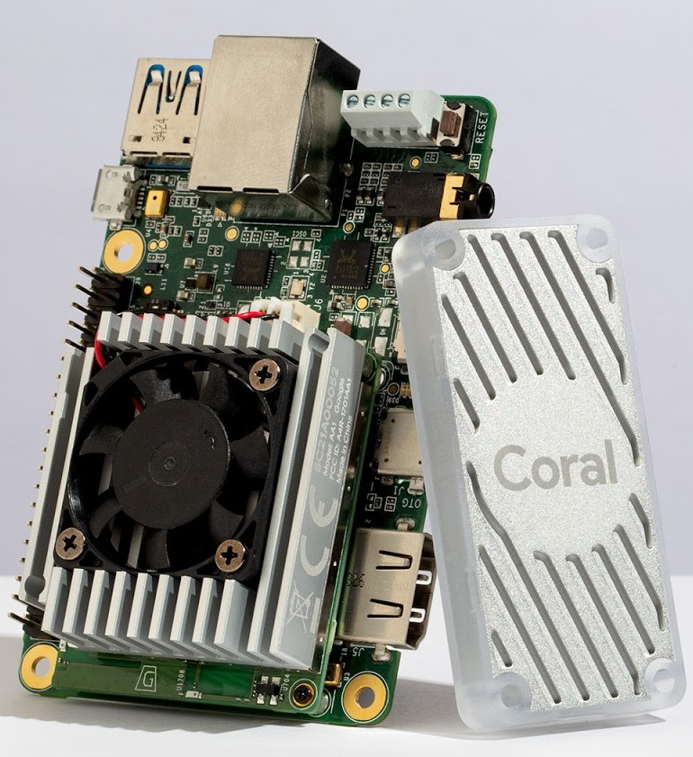
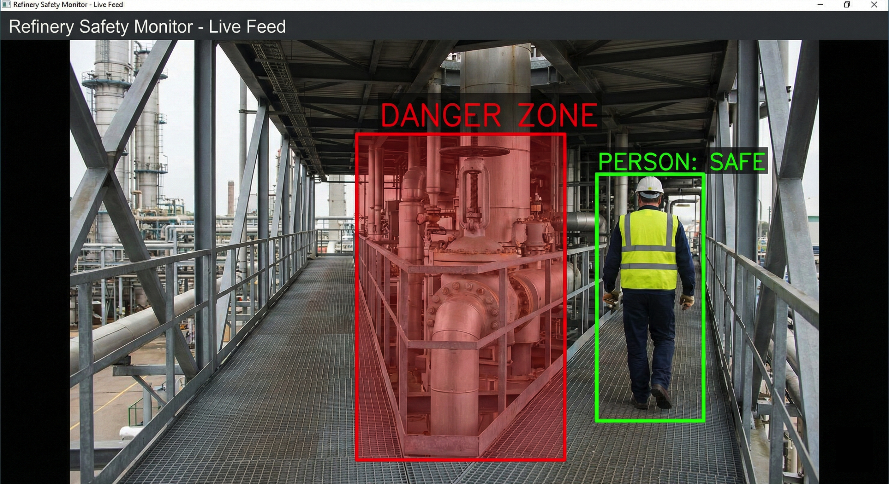

# Object-Detection-Oil-Refinery-Site-Safety-GoogleTPU 🛢️🛡️
### Powered by Google Coral Edge TPU

<p align="center">
  
</p>
## 📋 Overview
This repository provides a high-performance **Edge AI** solution for monitoring safety at oil and gas sites. Using a **Google Coral USB TPU**, we perform real-time object detection to identify personnel and trigger alerts if they enter hazardous "Restricted Zones."

<p align="center">
  
</p>

🛠️ Hardware Requirements & Specifications
To achieve real-time, low-latency inference at the edge, this project utilizes the **Google Coral USB Accelerator**.

### Core Specifications:
* **ML Accelerator:** Google Edge TPU coprocessor providing **4 TOPS** (int8); 2 TOPS per watt.
* **Performance:** Capable of executing state-of-the-art mobile vision models like **MobileNet v2 at almost 400 FPS**.
* **Connectivity:** USB 3.0 Type-C (Data/Power). *Compatible with USB 2.0 but at reduced inference speeds.*
* **Power Consumption:** Highly efficient, using only 0.5 watts for each TOPS.
* **Dimensions:** 65 mm x 30 mm.
* **Host Compatibility:** Debian Linux (including Raspberry Pi), macOS, and Windows 10/11.

🚀 Installation
1.  **Install the Edge TPU Runtime:**
    ```bash
    sudo apt-get install libedgetpu1-std
    ```
2.  **Install dependencies:**
    Use `pip` to install the required libraries:
    ```bash
    pip3 install -r requirements.txt
    ```

🔍 Visual Logic: Geofencing
The system draws a virtual perimeter over the camera feed. If a detected `person` coordinate overlaps with the `DANGER_ZONE` coordinates, a red alert is logged. By utilizing the 4 TOPS performance of the Edge TPU, the detection happens in milliseconds, ensuring immediate safety response.

<p align="center">
  
</p>

📂 Project Structure
* `safezone_monitor.py`: Core logic for detection and restricted area checking.
* `requirements.txt`: Python dependencies.
* `images/`: UI elements and demonstration images.
